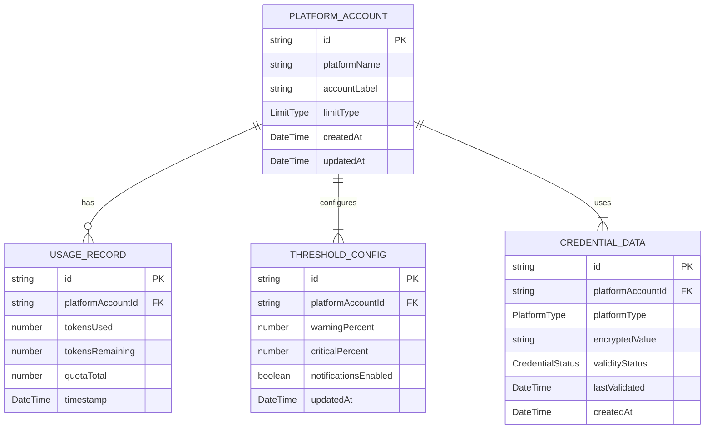
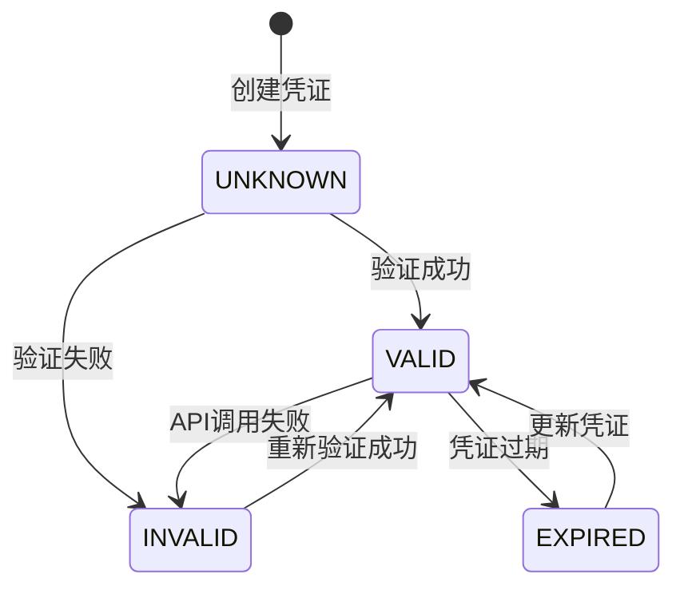

# Data Model: Multi-Platform AI Token Usage Monitor

**Feature**: 001-token-usage-monitor
**Date**: 2026-03-03
**Status**: Final

## Overview

本文档定义了多平台AI Token监控工具的数据模型。数据存储在浏览器IndexedDB中，使用Dexie.js作为ORM层。

---

## Entity Relationships



---

## Entities

### 1. PlatformAccount (平台账户)

表示单个AI平台上的一个API账户。

**Table Name**: `platform_accounts`

**Fields**:

| Field | Type | Nullable | Description | Validation |
|-------|------|----------|-------------|------------|
| id | string | No | 主键，UUID格式 | UUID v4 |
| platformName | string | No | 平台名称（ark/zai/minimax/claude） | 枚举值 |
| accountLabel | string | No | 用户定义的账户标签/名称 | 1-50字符 |
| limitType | string | No | 限制类型（daily/monthly/cumulative） | 枚举值 |
| createdAt | DateTime | No | 创建时间戳 | ISO 8601 |
| updatedAt | DateTime | No | 最后更新时间戳 | ISO 8601 |

**Indexes**:
- Primary: `id`
- Unique: `platformName + accountLabel` (同一平台下标签唯一)

**Enums**:

```typescript
enum PlatformType {
  ARK = 'ark',
  ZAI = 'zai',
  MINIMAX = 'minimax',
  CLAUDE = 'claude'
}

enum LimitType {
  DAILY = 'daily',           // 每日重置
  MONTHLY = 'monthly',       // 每月重置
  CUMULATIVE = 'cumulative'  // 累计不重置
}
```

---

### 2. UsageRecord (使用记录)

表示某个时间点的token使用快照。

**Table Name**: `usage_records`

**Fields**:

| Field | Type | Nullable | Description | Validation |
|-------|------|----------|-------------|------------|
| id | string | No | 主键，UUID格式 | UUID v4 |
| platformAccountId | string | No | 关联的平台账户ID | 外键 |
| tokensUsed | number | No | 已使用的token数量 | >= 0 |
| tokensRemaining | number | No | 剩余的token数量 | >= 0 |
| quotaTotal | number | No | 总配额 | > 0 |
| timestamp | DateTime | No | 记录时间戳 | ISO 8601 |

**Indexes**:
- Primary: `id`
- Compound: `[platformAccountId, timestamp]` (用于查询某平台的历史记录)
- Single: `timestamp` (用于按时间范围查询)

**Validation Rules**:
- `tokensUsed <= quotaTotal` (已使用不能超过总额)
- `tokensRemaining = quotaTotal - tokensUsed` (剩余量计算)

---

### 3. ThresholdConfig (阈值配置)

表示用户为某个平台账户设置的警报阈值。

**Table Name**: `threshold_configs`

**Fields**:

| Field | Type | Nullable | Description | Validation |
|-------|------|----------|-------------|------------|
| id | string | No | 主键，UUID格式 | UUID v4 |
| platformAccountId | string | No | 关联的平台账户ID | 外键，唯一 |
| warningPercent | number | No | 警告阈值百分比 | 0-100 |
| criticalPercent | number | No | 严重警告阈值百分比 | 0-100，> warningPercent |
| notificationsEnabled | boolean | No | 是否启用通知 | - |
| updatedAt | DateTime | No | 最后更新时间戳 | ISO 8601 |

**Indexes**:
- Primary: `id`
- Unique: `platformAccountId` (每个账户只有一个配置)

**Default Values**:
- `warningPercent`: 70
- `criticalPercent`: 90
- `notificationsEnabled`: true

**Validation Rules**:
- `0 <= warningPercent < criticalPercent <= 100`

---

### 4. CredentialData (凭证数据)

表示用于访问平台API的认证信息，加密存储。

**Table Name**: `credential_data`

**Fields**:

| Field | Type | Nullable | Description | Validation |
|-------|------|----------|-------------|------------|
| id | string | No | 主键，UUID格式 | UUID v4 |
| platformAccountId | string | No | 关联的平台账户ID | 外键，唯一 |
| platformType | string | No | 平台类型 | 枚举值 |
| encryptedValue | string | No | 加密后的凭证值 | 非空 |
| validityStatus | string | No | 凭证有效性状态 | 枚举值 |
| lastValidated | DateTime | Yes | 最后验证时间 | ISO 8601 |
| createdAt | DateTime | No | 创建时间戳 | ISO 8601 |

**Indexes**:
- Primary: `id`
- Unique: `platformAccountId` (每个账户只有一个凭证)

**Enums**:

```typescript
enum CredentialStatus {
  VALID = 'valid',           // 凭证有效
  INVALID = 'invalid',       // 凭证无效
  UNKNOWN = 'unknown',       // 未验证
  EXPIRED = 'expired'        // 已过期
}
```

**Security Notes**:
- `encryptedValue` 使用 Web Crypto API 加密
- 加密密钥可由用户提供或浏览器生成
- 每次存储凭证前都进行加密
- 读取时解密仅在内存中进行

---

## State Transitions

### CredentialStatus Transition



---

## Data Lifecycle

### UsageRecord Retention

| Data Age | Action |
|----------|--------|
| < 30 days | 保留 |
| 30-90 days | 可选保留（用户配置） |
| > 90 days | 删除（自动清理） |

**Cleanup Strategy**:
- 定时任务每小时运行一次
- 删除超过保留期的记录
- 保留每个平台的最后一条记录（即使超过保留期）

---

## Derived Views

### CurrentUsageView (当前使用情况视图)

从 `UsageRecord` 中获取每个平台的最新记录，计算：

- `usagePercent` = (tokensUsed / quotaTotal) * 100
- `status` = 根据阈值配置判断（normal/warning/critical）
- `dataFreshness` = 当前时间 - timestamp（用于显示数据新鲜度）

```typescript
interface CurrentUsageView {
  platformAccountId: string;
  platformName: string;
  accountLabel: string;
  tokensUsed: number;
  tokensRemaining: number;
  quotaTotal: number;
  usagePercent: number;
  status: 'normal' | 'warning' | 'critical';
  lastUpdate: DateTime;
  dataFreshness: number; // seconds
}
```

---

## Storage Schema (Dexie.js)

```typescript
import Dexie, { Table } from 'dexie';

class TokenMonitorDatabase extends Dexie {
  platformAccounts!: Table<PlatformAccount>;
  usageRecords!: Table<UsageRecord>;
  thresholdConfigs!: Table<ThresholdConfig>;
  credentialData!: Table<CredentialData>;

  constructor() {
    super('TokenMonitorDB');
    this.version(1).stores({
      platformAccounts: 'id, platformName, [platformName+accountLabel]',
      usageRecords: 'id, platformAccountId, [platformAccountId+timestamp], timestamp',
      thresholdConfigs: 'id, platformAccountId',
      credentialData: 'id, platformAccountId'
    });
  }
}

const db = new TokenMonitorDatabase();
export default db;
```

---

## TypeScript Type Definitions

```typescript
// Platform Account
interface PlatformAccount {
  id: string;
  platformName: PlatformType;
  accountLabel: string;
  limitType: LimitType;
  createdAt: string;
  updatedAt: string;
}

// Usage Record
interface UsageRecord {
  id: string;
  platformAccountId: string;
  tokensUsed: number;
  tokensRemaining: number;
  quotaTotal: number;
  timestamp: string;
}

// Threshold Configuration
interface ThresholdConfig {
  id: string;
  platformAccountId: string;
  warningPercent: number;
  criticalPercent: number;
  notificationsEnabled: boolean;
  updatedAt: string;
}

// Credential Data
interface CredentialData {
  id: string;
  platformAccountId: string;
  platformType: PlatformType;
  encryptedValue: string;
  validityStatus: CredentialStatus;
  lastValidated: string | null;
  createdAt: string;
}

// Enums
type PlatformType = 'ark' | 'zai' | 'minimax' | 'claude';
type LimitType = 'daily' | 'monthly' | 'cumulative';
type CredentialStatus = 'valid' | 'invalid' | 'unknown' | 'expired';

// Derived Types
interface CurrentUsageView {
  platformAccountId: string;
  platformName: PlatformType;
  accountLabel: string;
  tokensUsed: number;
  tokensRemaining: number;
  quotaTotal: number;
  usagePercent: number;
  status: 'normal' | 'warning' | 'critical';
  lastUpdate: string;
  dataFreshness: number;
}
```
